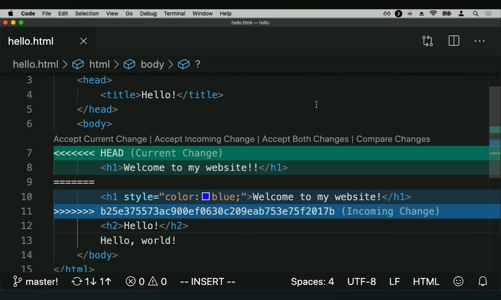

# Lecture 1

## Overview

Learning Git, a version control tool, not specific to web programming.

### Git Commands

* `git clone <url>` is a command we can run in order to take a repository(repo) from the internet and download it onto our own computer.

* `ls` stands for list and it lists the all the files and folders currently inside the working directory.

* `cd <directory_name>` command is used to change into a directory or folder.

* `cd ..` is used to go to the parent directory.

* `touch <file_name>` allows you to create a new file directly from the terminal.

* `code .` is used to open up the current directory in the current file insed a text editor.

* `git add <filename>` allows us to tell Git that we would like to add a file as one to track the next time we make a commit.

* `git commit -m "message"` tells the git repo to save a snapshot of the current state of the repo, keeping track of any of the changes that have been made to files that have been added using `git add`.

* `git status` allows us to see what's currently happening inside of the repo.

* `git push` is used to take the local changes and actually push then up to the server, GitHub, so that they're reflected there.

* `git commit -am "message"` allows us to add all of the files that have been changed and commit at the same time.

* `git pull` takes the changes that currently exist on GitHub and pulls the most recent changes down, so that the local repo has access to the latest version of all the code that is currently on GitHub.

* `git log` is useful if you ever need to keep track of all the changes that you have made to your code, i.e., keep track of all the commits you have made to the repo.

* `git reset --hard <commit>` is used if you want to go back to a previous commit. A hard reset is used when you want to reset everything back to a particular commit (using its commit hash).

* `git reset --hard origin/master` is used to reset the current version of the local repo to the latest version of the remote repo (on GitHub).

* `git branch` will tell you what branch you're currently on and what branches exist in the repo.

* `git checkout -b <branch_name>` is used to create and switch to a new branch.

* `git checkout <branch_name>` is used to switch to a branch that already exists.

* `git merge <branch_name>` will attempt to merge whatever is on the [branch_name] branch onto the current branch.

### Terminology

 * To make a **commit** is to save the current state of all the files, folders, and other assets in the repo.

 * **Merge conflict** when trying to merge your changes with the changes that someone else has made within the same part of the code.

 * When resolving a merge conflict, the changes between <<<<<HEAD and ====== are the changes made in the local repo. and the changes between ====== and >>>>> Hash ID are the changes made in the remote repo. For example:

 

 * To **resolve a merge conflict**, open the file with the conflict(s) and modify it until you are satisfied with the changes and remove the commit markers that git added automatically.

 * **hash** is the unique sequence of numbers and characters that helps to identify any particular commit.

* **Branches** are Git's way of working on different parts of the repo at the same time.

* At any given time, your focus is only on one of the branches. And where your focus is, what is the current state of your repo is, is designated by **head**.

* You can work on different branches by switching where your head is, switching from one branch to another.

* Only when you're satisfied, we can merge changes from different branches so that everything comes back to a unified branch.

* **Forking** a GitHub repo means making your own copy of the original repo.

* Generate a **Pull request** to request that your code be pulled and merged into a shared remote repo.

* **Git Pages** allows you to create and publish your own website that other people can view.